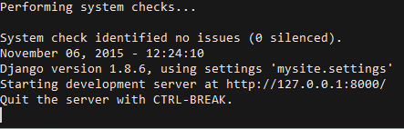

# Trabajo en equipo para la materia de Analisis y Diseño de Sistemas de Información
## Sistema de reportes de reparación y calibración 
### Paquetes necesarios: 


 * [Python 2.7.x][1]
 * [Django][2]
 * [Pip (Para instalar Django)][3]

###Uso:
#####Para correr el servidor entramos a la carpeta mysite en la terminal y utilizamos el siguiente comando:

```
 python manage.py runserver

```

nos debe mostrar el siguiente mensaje:



Significa que podemos entrar a la URL por defecto en nuestro navegador, en este caso 127.0.0.1:8000 o localhost:8000


Entrando a la URL e iniciando sesion nos muestra la pantalla con todas las opciones a nuestra disposicion (Si tenemos los permisos)


###Crear una cuenta de adminstrador:

#####para crear una cuenta de administrador entramos a la carpeta mysite en la terminal y utilizamos el siguiente comando:

```
 python manage.py createsuperuser

```

Por defecto ya tenemos un usuario "administrador" con contraseña "administrador"

#####Para iniciar sesion en el panel de administración debemos acceder a la URL 127.0.0.1:8000/admin/

Desde el panel de administracion podemos agregar, eliminar o editar registros, y crear nuestros propios usuarios "Tecnicos" y otorgarles permisos de creacion y consultas de registros


[1]: https://www.python.org/downloads/
[2]: https://docs.djangoproject.com/en/1.8/topics/install/#installing-official-release
[3]: https://pip.pypa.io/en/latest/installing/#install-pip